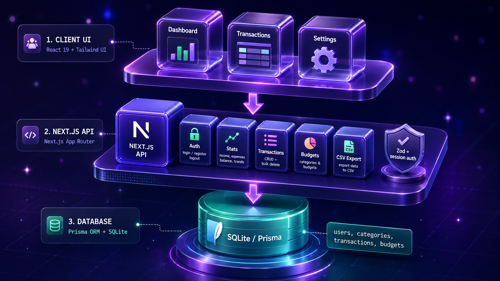
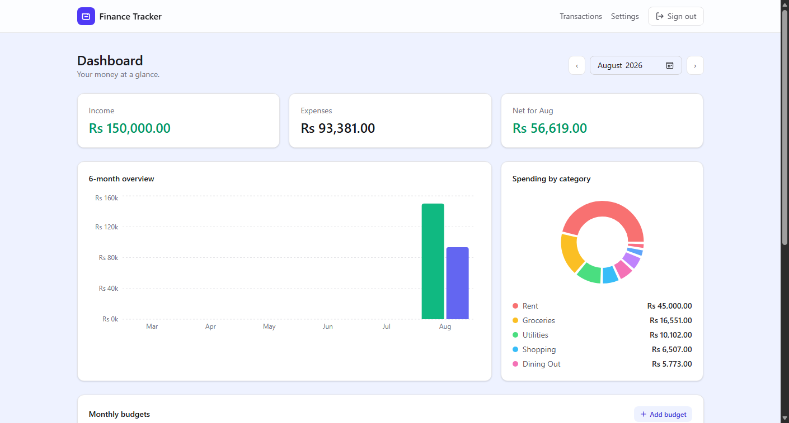
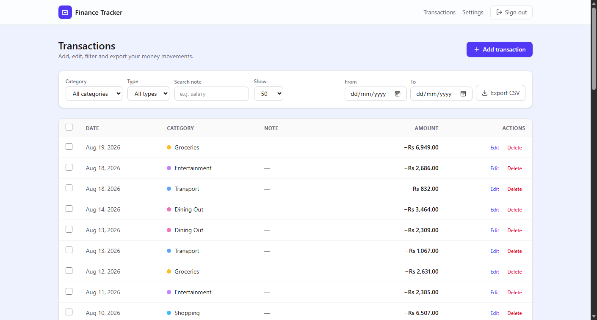
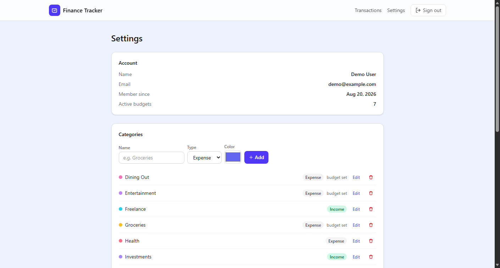
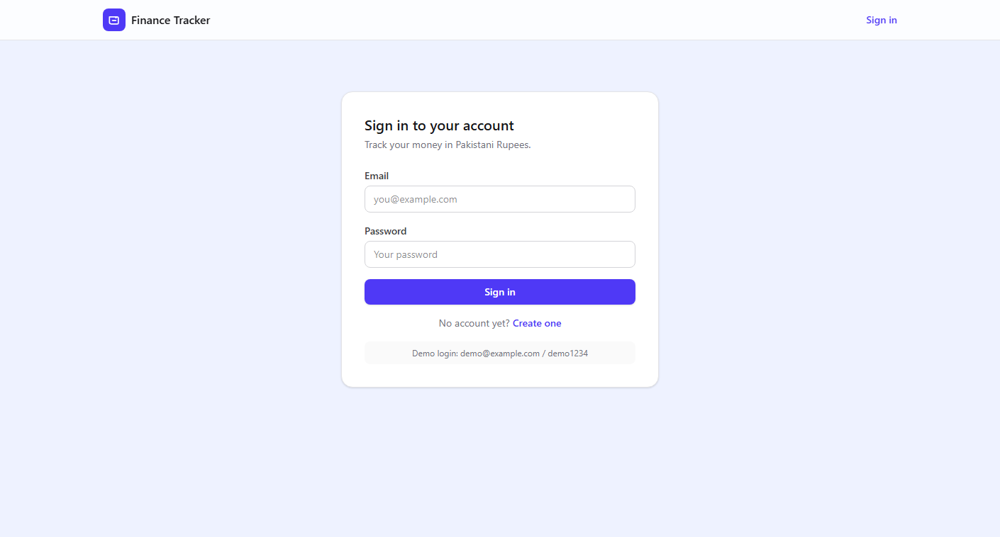

# 🚀 Finance Tracker — Personal Finance Manager

<p align="center">
  
</p>

<h3 align="center">
Income & Expense Tracking, Monthly Budgets, Dashboard Analytics & CSV Export
</h3>

<p align="center">


</p>


---


A modern **personal finance manager** built with **Next.js**, **Prisma**, and **SQLite**.


The app tracks income and expenses in **Pakistani Rupees (PKR)**, sets monthly budgets per category with live progress bars, and visualizes everything on an analytics dashboard — with secure per-user accounts, instant search, bulk actions, and CSV export.


---


# 📌 Overview


Money comes in, money goes out — but without a clear record of where it goes, staying on top of personal finances is nearly impossible.


Typical money-management workflows include:


* 💰 Recording daily income and expenses
* 📊 Reviewing monthly income vs spending
* 🎯 Setting a monthly budget for each spending category
* 🔍 Finding a specific transaction by its note
* 🧹 Cleaning up mistakes with bulk delete
* 📤 Exporting statements for records or taxes


Traditional expense tracking is challenging because of:


* Expenses scattered across notes, receipts, and bank statements
* No clear picture of where money goes each month
* Overspending that only becomes visible after the month ends
* Spreadsheets that take time to maintain and are easy to abandon
* Statements that are hard to filter, search, or export


This project automates the complete workflow: log a transaction once, and Finance Tracker categorizes it, checks it against your budgets, charts it on the dashboard, and makes it searchable and exportable — all behind a secure per-user account.


---


# 🚀 Key Features


| Feature                                    | Status |
| ------------------------------------------ | :----: |
| Secure Accounts (Sign Up / Log In)         |    ✅   |
| Change Password                            |    ✅   |
| Delete Account (With All Data)             |    ✅   |
| Add / Edit / Delete Transactions           |    ✅   |
| Search Transactions by Note                |    ✅   |
| Filter by Category, Type & Date Range      |    ✅   |
| Bulk Delete Transactions                   |    ✅   |
| Monthly Budgets per Category               |    ✅   |
| Live Budget Progress & Over-Budget Warnings|    ✅   |
| Dashboard Summary Cards                    |    ✅   |
| 6-Month Income vs Expense Chart            |    ✅   |
| Spending-by-Category Pie Chart             |    ✅   |
| Month Navigation (Picker + Arrows)         |    ✅   |
| Custom Categories (Name / Type / Color)    |    ✅   |
| CSV Export (Optionally Date-Scoped)        |    ✅   |
| PKR Formatting (Integer Paise Storage)     |    ✅   |
| Per-User Data Isolation                    |    ✅   |
| Unit Tests (Vitest)                        |    ✅   |


---


# 🏗️ System Architecture


<p align="center">
  
</p>


The app is organised into three primary layers:


* **Frontend Layer** — React 19 client components for the dashboard, transaction manager, forms, and toast notifications.
* **Backend Layer** — Next.js App Router with Route Handlers under `/api`, validated by Zod schemas on every request.
* **Data Layer** — Prisma ORM with SQLite, every query scoped to the authenticated user id.


---


# 🌐 Frontend Layer


### Technology Stack


* Next.js 16 (App Router)
* React 19
* TypeScript
* Tailwind CSS v4
* Recharts


### Responsibilities


* Dashboard with summary cards, bar chart, and pie chart
* Transactions page with filters, search, and bulk selection
* Transaction add/edit form with category grouping
* Budgets card with progress bars and inline editing
* Settings page (account info, categories, password, danger zone)
* Toast notifications for every action


---


# ⚙️ Backend Layer


### Technology Stack


* Next.js Route Handlers
* HMAC-SHA256 signed session cookies
* Prisma ORM
* Zod validation schemas
* bcryptjs


### Responsibilities


* User authentication & session management
* Transactions CRUD + bulk delete
* Categories CRUD + budget upsert/remove
* Monthly stats aggregation (totals, 6-month series, category breakdown)
* CSV export with optional date scoping
* Authorization and ownership checks on every mutation


---


# 🗄️ Data Layer


The complete data workflow uses Prisma with relational models for users, categories, transactions, and budgets.


```text
User signs up / logs in (signed session cookie)
          │
          ▼
Dashboard loads stats (/api/stats)
          │
          ▼
Add / Edit / Delete transactions (fetch + JSON)
          │
          ▼
Zod validation in Route Handlers
          │
          ▼
Prisma ORM writes to SQLite (scoped to user id)
          │
          ▼
Data persists and re-renders on refresh
```


Two data rules keep everything consistent:


* **Money is stored as integer paise** (Rs 1 = 100 paise) — no floating-point rounding errors — and formatted for display with a shared helper.
* **Dates are stored as UTC noon** (`YYYY-MM-DDT12:00:00Z`) so a transaction never shifts to another day, regardless of timezone.


---


# 🔐 Authentication & Security


The project uses stateless signed session cookies.


### Purpose


Secure sign-up, login, logout, password change, and account deletion for every user.


### Details


* Passwords hashed with **bcrypt** (12 rounds)
* Sessions are **HMAC-SHA256-signed payloads** in an httpOnly cookie (`pb_session`, 30-day expiry)
* Protected pages redirect unauthenticated users to `/login`
* Every route handler verifies the session and scopes queries to the user id
* Account deletion requires the current password and removes all data instantly


---


# 📸 Screenshots


## 📊 Dashboard


<p align="center">

</p>


---


## 💸 Transactions


<p align="center">

</p>


---


## ⚙️ Settings


<p align="center">

</p>


---


## 🔒 Login


<p align="center">

</p>


---


# ✨ Features


## 👤 Accounts & Security


The system manages secure per-user accounts.


**Capabilities:**


* Sign up / log in with hashed passwords (bcrypt)
* Stateless signed sessions (30-day expiry)
* Protected routes redirect unauthenticated users
* Change password anytime from Settings
* Delete your account — removes all categories, budgets, and transactions instantly


---


## 💸 Transactions


The system records every money movement.


**Capabilities:**


* Add income and expense transactions in rupees
* Edit any transaction inline
* Delete single transactions or select many for bulk delete
* Filter by category, type, and date range
* Amounts stored as integer paise for exact math


---


## 🎯 Budgets


The system keeps spending in check.


**Capabilities:**


* Set a monthly limit per expense category
* Live progress bars turn amber near the limit and red when over
* Edit limits inline or remove budgets entirely
* Spent amounts update automatically from transactions


---


## 📊 Dashboard


The system summarizes each month at a glance.


**Capabilities:**


* Income, expenses, and net cards for the selected month
* 6-month income vs expense bar chart
* Spending-by-category pie chart with legend
* Month navigation via arrows or a month picker


---


## 🏷️ Categories


The system adapts to your own money habits.


**Capabilities:**


* Create custom income/expense categories
* Rename, recolor, and change type anytime
* Categories power transactions, budgets, and charts
* Categories with transactions cannot be deleted accidentally


---


## 🔍 Search & Export


The system makes your data portable.


**Capabilities:**


* Instant search across transaction notes
* Export all transactions as UTF-8 CSV
* Scope exports to a date range (e.g. one month)
* CSV opens cleanly in Excel and Google Sheets


---


# 📂 Project Structure


```text
Finance-Tracker/
│
├── assets/                     # README images (screenshots, architecture, thumbnail)
│
├── prisma/
│   ├── schema.prisma           # User, Category, Transaction, Budget models
│   ├── migrations/             # SQL migrations
│   └── seed.mjs                # Demo data (demo@example.com / demo1234)
│
├── src/
│   ├── app/
│   │   ├── api/
│   │   │   ├── auth/           # register, login, logout, me, password, account
│   │   │   ├── transactions/   # list, create, bulk delete, edit, delete
│   │   │   ├── categories/     # list, create, edit, delete, budgets
│   │   │   ├── stats/          # monthly aggregates for the dashboard
│   │   │   └── export/         # CSV export
│   │   ├── transactions/page.tsx
│   │   ├── settings/page.tsx
│   │   ├── login/page.tsx
│   │   ├── register/page.tsx
│   │   ├── layout.tsx          # Root layout + header
│   │   └── page.tsx            # Dashboard
│   │
│   ├── components/
│   │   ├── Dashboard.tsx       # Summary cards + charts + month navigation
│   │   ├── TransactionsView.tsx
│   │   ├── TransactionForm.tsx
│   │   ├── BudgetsCard.tsx
│   │   ├── CategoryManager.tsx
│   │   ├── ChangePasswordForm.tsx
│   │   ├── DeleteAccountForm.tsx
│   │   ├── AuthForm.tsx        # Login / register form
│   │   ├── LogoutButton.tsx
│   │   ├── ToastProvider.tsx
│   │   └── icons.tsx
│   │
│   └── lib/
│       ├── prisma.ts           # Prisma client singleton
│       ├── auth.ts             # Session helpers + password hashing
│       ├── session.ts          # Signed token create/verify
│       ├── validation.ts       # Zod schemas for every endpoint
│       ├── format.ts           # Currency/date/month formatting
│       ├── types.ts            # Shared TypeScript types
│       └── __tests__/          # Vitest unit tests
│
├── .github/workflows/ci.yml    # CI: install, migrate, test, lint, build
├── .env.example                # Environment template
├── .gitignore
└── README.md
```


---


# 🔌 Application Routes & Endpoints


| Route / Endpoint              | Method       | Purpose                              |
| ----------------------------- | ------------ | ------------------------------------ |
| `/`                           | GET          | Dashboard (protected)                |
| `/transactions`               | GET          | Transactions manager (protected)     |
| `/settings`                   | GET          | Settings (protected)                 |
| `/login`                      | GET          | Login page                           |
| `/register`                   | GET          | Register page                        |
| `/api/auth/register`          | POST         | Create account                       |
| `/api/auth/login`             | POST         | Sign in                              |
| `/api/auth/logout`            | POST         | Clear session                        |
| `/api/auth/me`                | GET          | Current user                         |
| `/api/auth/password`          | POST         | Change password                      |
| `/api/auth/account`           | DELETE       | Delete account + all data            |
| `/api/transactions`           | GET          | List (filters, search, date range)   |
| `/api/transactions`           | POST         | Create transaction                   |
| `/api/transactions`           | DELETE       | Bulk delete                          |
| `/api/transactions/[id]`      | PATCH        | Edit transaction                     |
| `/api/transactions/[id]`      | DELETE       | Delete transaction                   |
| `/api/categories`             | GET / POST   | List / create categories             |
| `/api/categories/[id]`        | PATCH        | Edit category / set or remove budget |
| `/api/categories/[id]`        | DELETE       | Delete empty category                |
| `/api/stats`                  | GET          | Monthly totals, series, budgets      |
| `/api/export`                 | GET          | CSV download (optional date scope)   |


Every endpoint validates input with **Zod** and authorizes against the session before touching the database.


---


# 💻 Installation


## Clone Repository


```bash
git clone https://github.com/huzaifa-ai-tech/Finance-Tracker.git


cd Finance-Tracker
```


---


## Install Dependencies


```bash
npm install
```


---


## Configure Environment


Copy the template and set your values:


```bash
cp .env.example .env
```


Generate a session secret (32+ random bytes):


```bash
node -e "console.log(require('crypto').randomBytes(32).toString('hex'))"
```


Edit `.env` with your secret:


```dotenv
DATABASE_URL="file:./dev.db"
SESSION_SECRET="your-long-random-secret-here"
```


---


## Setup Database


```bash
npx prisma migrate dev
npx prisma db seed
```


This creates the SQLite database, applies all migrations, and seeds demo data.


> Demo account: `demo@example.com` / `demo1234`


---


## Run the App


```bash
npm run dev
```


Open `http://localhost:3000`, log in with the demo account (or register your own), and start tracking your money.


---


# 🛠️ Technologies Used


## ⚛️ Frontend


* Next.js 16 (App Router)
* React 19
* TypeScript
* Tailwind CSS v4
* Recharts


---


## ⚙️ Backend


* Next.js Route Handlers
* Zod validation
* Prisma ORM
* bcryptjs
* HMAC-SHA256 signed sessions


---


## 🗄️ Database


* SQLite (zero-setup local storage)


---


## 🧪 Testing


* Vitest (formatting, sessions, validation)


---


# ⚡ Advantages


* Modern full-stack architecture (Next.js + React + TypeScript)
* Exact money math with integer paise storage
* Timezone-safe dates (UTC noon)
* Secure authentication with hashed passwords and signed cookies
* Real database persistence with zero setup (SQLite)
* Live budget tracking with over-budget warnings
* One-click CSV export for records or taxes
* Authorization checked on every mutation
* Unit-tested core logic with CI on every push


---


# ⚠️ Limitations


* Single currency (PKR) — no multi-currency support yet.
* No recurring/auto-added transactions yet.
* Local SQLite file — not designed for multi-server deployments.
* No email verification or social login yet.
* Budget warnings appear in the app only — no push/email notifications.


---


# 🔮 Future Improvements


Planned enhancements include:


* Recurring transactions (rent, salary, subscriptions)
* Multi-currency support with exchange rates
* Dark / light theme toggle
* Budget alert notifications
* Cloud database deployment (PostgreSQL)
* Docker setup for easy hosting
* Receipt attachments per transaction


---


# 👨‍💻 Author


**Huzaifa**


GitHub:
https://github.com/huzaifa-ai-tech


---


# 🙏 Acknowledgements


This project is built using several outstanding open-source technologies:


* [Next.js](https://nextjs.org/)
* [React](https://react.dev/)
* [TypeScript](https://www.typescriptlang.org/)
* [Tailwind CSS](https://tailwindcss.com/)
* [Prisma](https://www.prisma.io/)
* [Recharts](https://recharts.org/)
* [Zod](https://zod.dev/)
* [bcryptjs](https://github.com/dcodeIO/bcrypt.js)
* [Vitest](https://vitest.dev/)


Special thanks to the open-source community for providing these powerful tools and frameworks that made this project possible.


---


# ⚠️ Disclaimer


This project is developed for educational purposes.


The application is provided without warranty and should be configured with your own `SESSION_SECRET` before any production use.


---


# ⭐ Support


If you found this project useful, please consider giving it a **⭐ Star** on GitHub.


Your support helps improve the project and motivates future development.